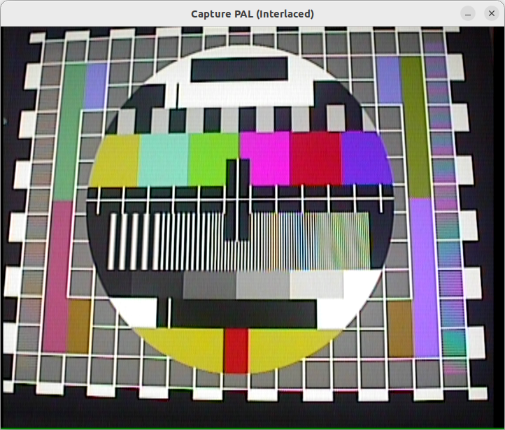

# Capture example in C++ (With SDL Display)

For use with the video capture device on the GXA-1 mission computer.

Press <kbd>f</kbd> to switch to fullscreen

## PAL TV standard

```
./bin/capture_cpp -io_method 1 -device /dev/video0 -video_standard=PAL
```

for Interlaced

```
./bin/capture_cpp -io_method 1 -device /dev/video0 -video_standard=PAL -interlaced
```
 > NOTE: In interlaced mode each frame is scaled using swscale SWS_BILINEAR interpolation see [here](https://ffmpeg.org/doxygen/6.1/group__libsws.html). This is not a deinterlcing algorithm but designed for speed.

### Interlaced vs Progressive

Interlaced video @50 FPS

Progressing video @25 FPS



** Interlaced video using interpolation to 'fill in' the missing lines **


** Progressive video lines interleaved, no deinterlacing algorithm applied **

## NTSC TV standard

```
./bin/capture_cpp -io_method 1 -device /dev/video3 -video_standard=NTSC
```

